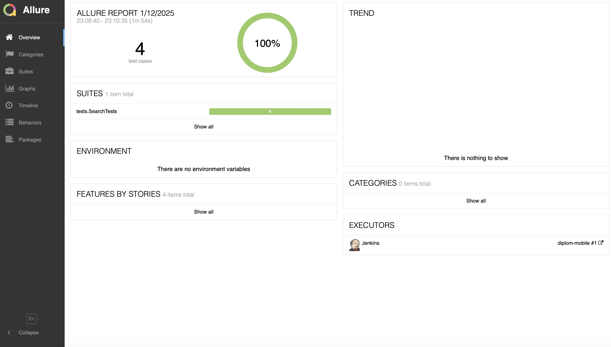
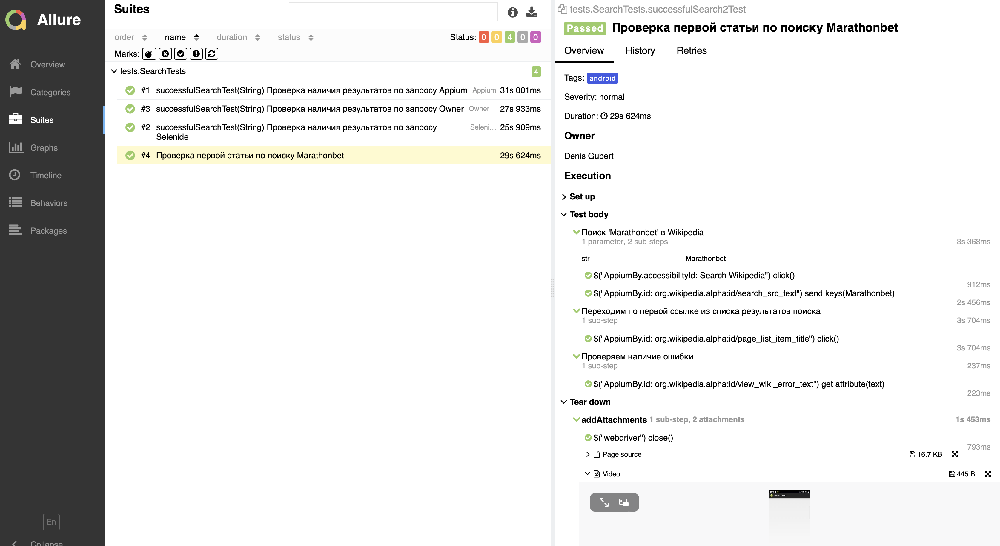
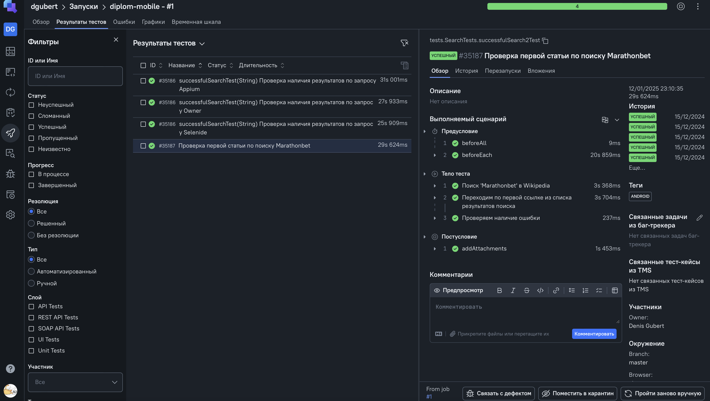

<h1 align="center">Дипломная работа (MOBILE).<br>Приложение Википедия.</h1>


##  **Содержание:**

---

* [Технологии и инструменты](#технологии-и-инструменты)
* [Проверки](#-проверки)
* [Запуск тестов в Jenkins](#-запуск-тестов-в-jenkins)
* [Allure и TestOps Reports](#--allure-report)

## Технологии и инструменты:

---


| Java                                                                                         | IntelliJ  <br>  Idea                                                                                                 | GitHub                                                                                                           | JUnit 5                                                                                                           | Gradle                                                                                                     | Selenide                                                                                                         | Appium                                                                                                                | Allure <br> Report                                                                                                         | Jenkins                                                                                                          | TestOps                                                                                                  |
|:---------------------------------------------------------------------------------------------|----------------------------------------------------------------------------------------------------------------------|------------------------------------------------------------------------------------------------------------------|-------------------------------------------------------------------------------------------------------------------|------------------------------------------------------------------------------------------------------------|------------------------------------------------------------------------------------------------------------------|-----------------------------------------------------------------------------------------------------------------------|----------------------------------------------------------------------------------------------------------------------------|------------------------------------------------------------------------------------------------------------------|----------------------------------------------------------------------------------------------------------|
| <a href="https://www.java.com/"> </a> | <a href="https://www.jetbrains.com/idea/"></a> | <a href="https://github.com/"></a> | <a href="https://junit.org/junit5/"></a> | <a href="https://gradle.org/"></a> | <a href="https://selenide.org/"></a> | <a href="http://appium.io/docs/en/latest/"></a> | <a href="https://github.com/allure-framework"></a> | <a href="https://www.jenkins.io/"></a> | <a href="https://qameta.io"></a> |


##  Проверки:

---

- ✓ *Проверка работы поиска статей*
- ✓ *Проверка открытия одной из статей*


##  Запуск тестов в Jenkins:

---

**Сборка в [Jenkins](https://jenkins.autotests.cloud/job/diplom-mobile/)**
- *BRANCH_NAME - ветка разработки тестов, по умолчанию master*
- *PLATFORM - платформа тестов, по умолчанию android*

**Команда для запуска тестов**
```bash  
clean test -Denv=android
clean test -Denv=ios
```

## </a>  <a name="Allure"></a>Allure и TestOps Reports	</a>

---

## Основная страница Allure отчёта

<p align="center">  
  
</p>  

## Тест-кейсы Allure

<p align="center">  

</p>

## Основная страница TestOps отчёта

<p align="center">  
  
</p>  

## Тест-кейсы TestOps

<p align="center">  

</p>